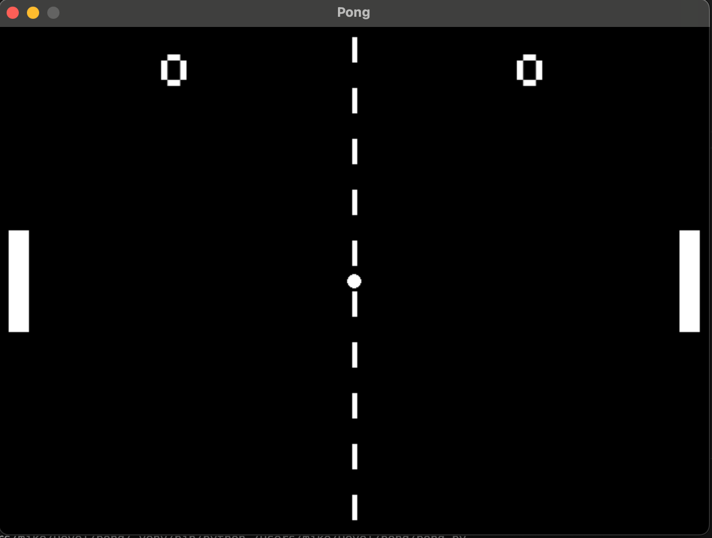

# Pong

This is a pygame implmentation of the classic game Pong.

* This is a 2 Player game. 
  * Player 1(left) uses "w" and "s" for up/down
  * Player 2(right) uses the up/down arrow keys
* Spacebar launches the ball
* First to 10 points wins

